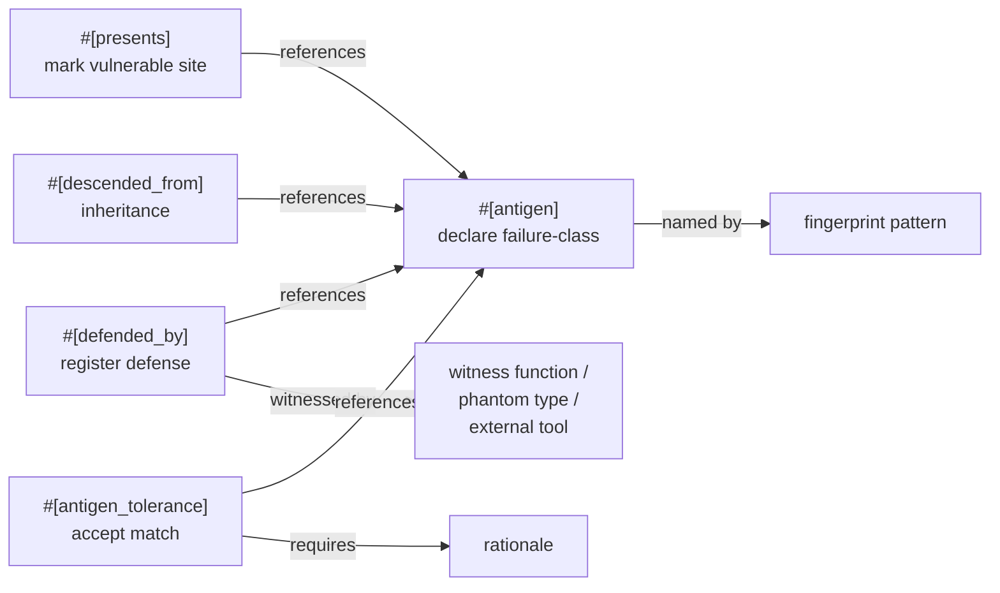
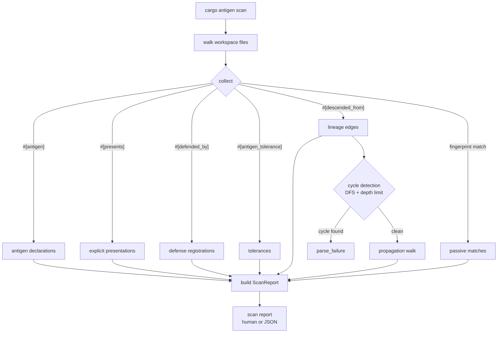
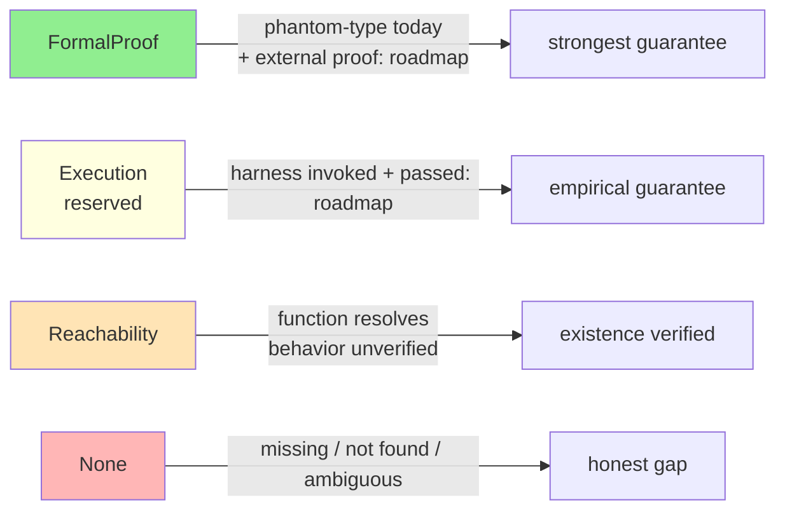
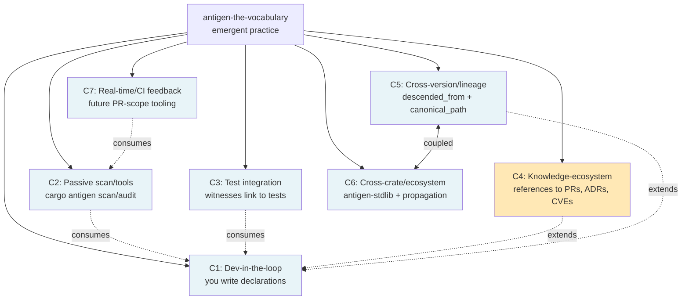
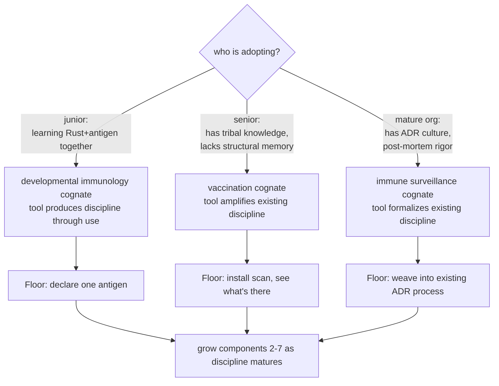
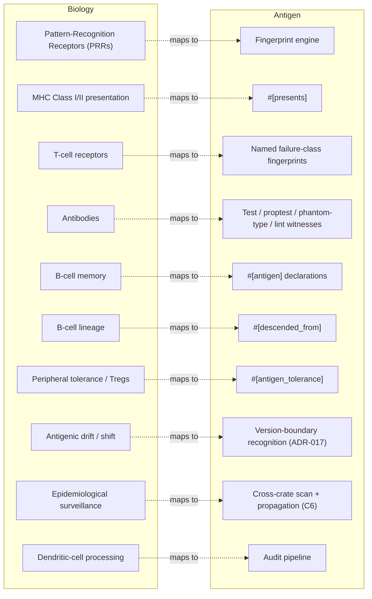
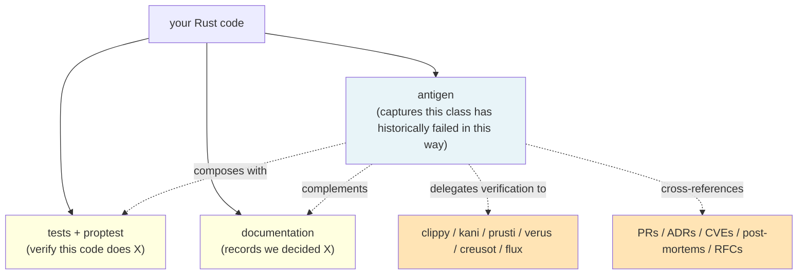

# Antigen — Visual Reference

> Diagrams of antigen's architecture, flow, and key concepts. Mermaid
> source renders natively on GitHub and most modern markdown viewers.
> If you're reading on docs.rs (which may not render mermaid), the
> diagram source is itself reasonably parseable as structured text.

---

## The five vocabulary primitives



The vocabulary is the shared coordination layer. Each primitive
references the antigen type and adds different structure.

---

## Scan flow



The scan is a single pass over the workspace, with cycle detection
and propagation walk for `#[descended_from]` chains.

---

## Audit flow

```mermaid
graph TD
    Start[cargo antigen audit] --> Scan[run scan]
    Scan --> Loop{for each<br/>#[defended_by]}
    Loop --> Resolve[resolve witness identifier]
    Resolve --> Kind{witness kind?}
    Kind -->|"phantom turbofish<br/>Foo::<T>::ctor"| FP[FormalProof tier<br/>PhantomTypeShapeRecognized]
    Kind -->|"#[test] fn"| Reach1[Reachability tier<br/>TestAttributePresentNotInvoked]
    Kind -->|"proptest! fn"| Reach2[Reachability tier<br/>ProptestPresentNotInvoked]
    Kind -->|"clippy::lint"| Reach3[Reachability tier<br/>ExternalToolPrefixRecognized]
    Kind -->|"kani:: / prusti:: / ..."| Reach3
    Kind -->|"helper fn"| Reach4[Reachability tier<br/>FunctionResolves]
    Kind -->|not found| None[None tier<br/>WitnessNotFound]
    Kind -->|ambiguous| Amb[None tier<br/>WitnessAmbiguous]
    Kind -->|missing| Miss[None tier<br/>WitnessMissing]

    FP --> Report[audit report<br/>tier-honest]
    Reach1 --> Report
    Reach2 --> Report
    Reach3 --> Report
    Reach4 --> Report
    None --> Report
    Amb --> Report
    Miss --> Report
```

Per ADR-005 Amendment 3 (audit-tier-honesty), the audit reports the
*actual* verification strength, never a stronger one. The `Execution` tier is
reserved in the `WitnessTier` enum but not emitted today (it awaits harness
invocation — a recorded graduation path, see [`roadmap.md`](roadmap.md)); the audit
reports test/proptest functions at `Reachability` with disambiguating hints.

---

## Witness tier gradient



In v0.1, FormalProof is reached only by phantom-type witnesses.
Execution tier is reserved (no harness invocation yet). All test /
proptest / external-tool witnesses report Reachability with hints
disambiguating the case. See [`witness-tiers.md`](witness-tiers.md).

---

## Multi-component architecture



Seven components compose under the shared vocabulary. C1, C2, C3, C5,
C6, C7 are biology-tier (immune-system analogs); C4 is
engineered-boundary tier (human knowledge ecosystem, beyond biology).
See [`concepts.md`](concepts.md#multi-component-architecture) for
deeper framing.

---

## Adoption pathways



Three pathways, three different biology cognates, all real adoption
shapes. The "ideal user" property is replicable for the junior path
through onboarding, extended for the senior path through the tool,
formalized for the mature path through structural enforcement.

---

## Biology cognate map



The biology metaphor is load-bearing, not decorative. When biology
predicts a primitive, the project builds it. When biology breaks at
a boundary (e.g., the knowledge-ecosystem references field doesn't
have a clean biology cognate — see C4 in
[`concepts.md`](concepts.md)), that silence is honest information.

---

## What antigen relates to



Three pillars: testing checks specific behavior; documentation records
decisions; antigen captures structural failure-class memory. Antigen
composes with the others; it doesn't replace them.

---

## What a failure-class lifecycle looks like

```mermaid
graph TD
    Bug[bug found in production]
    Bug --> Fix[fixed in PR]
    Fix --> Tradi{traditional path}
    Tradi -->|commit message| LostA[lost to commit archive]
    Tradi -->|Slack thread| LostB[lost when channel archives]
    Tradi -->|docstring| LostC[drifts as code evolves]
    Tradi -->|post-mortem blog| LostD[platform dies in 5 years]

    Fix --> Antigen{antigen path}
    Antigen -->|declare #[antigen] with fingerprint| Decl[structural memory in src/antigens.rs]
    Antigen -->|references = [pr, blog, adr]| Bridge[bridge to lived context]
    Antigen -->|#[defended_by] on the fixed site| Imm[witness binds the fix to the lesson]

    Decl --> Future{6 months later}
    Bridge --> Future
    Imm --> Future

    Future -->|new dev writes similar code| Detect[cargo antigen scan detects it]
    Future -->|new dev refactors fixed site| Audit[audit catches lost immunity]
    Future -->|LLM agent generates code| LLM[LLM reads antigen declarations, respects them]

    style LostA fill:#FFB6B6
    style LostB fill:#FFB6B6
    style LostC fill:#FFB6B6
    style LostD fill:#FFB6B6
    style Decl fill:#90EE90
    style Bridge fill:#90EE90
    style Imm fill:#90EE90
```

The lesson learned in a single bug fix can either decay through
traditional carriers (none drift-resistant) or persist as structural
memory (durable; checkable by tooling; co-native for human + LLM
collaborators).

> **The efferent arc has its own diagrams.** The lifecycle above is the *afferent*
> half — how a class is born and detected. Once a class exists, the v0.6 organs let
> it *live*: a life-record, the two senses, the classifier, and CURATE. Those are
> diagrammed in [the v0.6 anatomy](the-v06-anatomy.md) (the organ topology) and
> [the learning loop](the-learning-loop.md) (the whole sense → classify → act loop,
> with the wired-vs-library-vs-frontier tiers marked honestly).

---

## See also

- [`the-v06-anatomy.md`](the-v06-anatomy.md) — the v0.6 organ-topology diagrams
- [`the-learning-loop.md`](the-learning-loop.md) — the afferent→efferent loop as one picture
- [`concepts.md`](concepts.md) — what antigen IS architecturally
- [`tutorial.md`](tutorial.md) — first 15 minutes
- [`macros.md`](macros.md) — full macro reference
- [`witness-tiers.md`](witness-tiers.md) — tier semantics
- [`output-formats.md`](output-formats.md) — scan/audit output
- [`index.md`](index.md) — full documentation map

---

*Diagrams as substrate. When something doesn't render, the mermaid
source is still parseable structured text. When something is wrong,
the docs are authoritative; this is a visual aid, not a primary
reference.*
