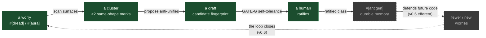

# The learning loop — where `propose` fits

> The other learning-core docs zoom in. [`the-felt-arc.md`](the-felt-arc.md)
> walks the four beats *as you live them*; [`concepts.md`](concepts.md) and
> [`the-keystone-explained.md`](the-keystone-explained.md) explain *why the
> safety line holds*; the [biology guide](the-immune-system-a-programmers-guide.md)
> takes each organ one mechanism at a time. This page zooms **out**: it shows
> `cargo antigen propose` not as a standalone command but as **one organ in a
> living loop** — where the candidate it drafts comes *from*, where the drafts it
> emits *go*, and which half of the loop v0.5 actually closes.
>
> Read this when `propose` makes sense in isolation but you can't yet see the
> system it belongs to.

---

## The system is not the binary

The first move in understanding any system is drawing its boundary honestly, and
the tempting boundary here is the wrong one. `antigen` is a binary; `propose` is a
subcommand of it. But the *learning loop* — the thing v0.5 is named for — is
larger than the binary. It has three parts:

1. **antigen's generative organs** — `scan` surfaces the marks; `propose`
   anti-unifies a cluster into a draft; a self-tolerance gate decides whether the
   draft is safe.
2. **a human who ratifies** — because the last step, naming a draft as a real
   failure-class, is a judgment antigen *refuses* to automate (the [why is
   here](the-keystone-explained.md)).
3. **the codebase the marks live on** — the `#[dread]`/`#[aura]` marks accrete on
   real source, and that source is the corpus the loop generalizes from.

Drop any one part and there is no loop. And the part that's easiest to forget is
the human — which matters, because **the loop's bottleneck is judgment, not
generation.** A machine can draft candidates faster than any person can ratify
them. So the whole system is designed around *spending human judgment sparingly*:
the gate would rather route one honest candidate to a person than flood them with
ten plausible-looking guesses. Hold the boundary at the binary and you miss the
single fact that shapes every design decision below it.

---

## The circulation: afferent and efferent

A failure-class memory has two directions of flow, and the immune system names
them precisely. **Afferent** flow carries signals *inward* — from the tissue, up
to where recognition happens. **Efferent** flow carries the response back *out* —
from the recognized memory, down to the tissue that needs defending. antigen's
learning loop has both, and **v0.5 builds the afferent half.**

### The afferent path — a worry becomes a candidate (this ships in v0.5)

This is the path `cargo antigen propose` runs end to end:

```
a worry                  scan surfaces it          ≥2 marks of the
#[dread] / #[aura]   →   ScanReport          →     same structural   →
"something's off          .marked_unknowns          shape cluster
 here, can't name it"

   propose()              GATE-G                    one of several
   anti-unifies      →    self-tolerance      →     first-class
   a draft                gate                       outcomes
```

Walk it one stage at a time:

- **A worry, marked.** A developer (or an agent) reading code feels a site is off
  but can't yet formalize why. They mark it — `#[dread(trigger = "…")]` for *"this
  is wrong"*, `#[aura]` for the lighter *"there may be something here."* The mark
  is the **afferent signal**: a felt assertion, not a hypothesis, with a person
  behind it. (The biological referent is *angor animi* — the clinical sense of
  doom a good clinician investigates rather than dismisses.)

- **Surfaced by scan.** The marks aren't a separate database; they live in the
  source and `scan` reads them into `ScanReport.marked_unknowns`, each with its
  trigger and a structural digest. This is the lymphatic flow — the signal travels
  from the tissue (the code) to where recognition happens.

- **A cluster.** When two or more marks share the *same structural shape*, they
  form a cluster — the raw material `propose` generalizes from. (Today antigen
  clusters by **exact** structural shape; loosening that so real-world singleton
  marks cluster is a later frontier — see the honest-scope note below.)

- **`propose()` anti-unifies a draft.** Given the cluster, `propose` finds the
  shape the members *share* that clean code does *not*, and drafts a candidate
  fingerprint. It generalizes to a disjunction — shared signals AND'd into a stable
  skeleton, per-member differences folded into an `any_of([…])` — so the draft
  binds the defects without collapsing to a skeleton that clean code also has. The
  draft is a **hypothesis, never a name** (the [felt arc](the-felt-arc.md)
  walks this beat in full).

- **GATE-G decides.** The self-tolerance gate routes the draft against an
  operator-supplied clean corpus and returns one of several first-class outcomes.

The command makes the boundary explicit in its own flags: you supply the cluster
root and you supply the clean corpus — `--clean-root` is **required**, because
antigen never labels unmarked code "clean" on your behalf. The gate is exactly as
strong as the corpus you vouch for.

```sh
cargo antigen propose \
    --cluster-root <where the #[dread] marks live> \
    --clean-root   <code you vouch is clean>
```

The gate's verdict is one of several first-class outcomes. The three you'll meet
most often — and can watch live on the runnable
[`examples/propose-demo/`](../examples/propose-demo/README.md) fixtures:

| Outcome | What it means | When |
|---|---|---|
| **no cluster** | fewer than two marks share an exact structural shape, so there's nothing to anti-unify | real-world marks are often singletons — *this is what antigen's own source returns today* |
| **route-to-human** | a real draft, but the gate can't *witness* that it generalizes (no near-miss sibling in the corpus) — so it routes the candidate to a human ratifier | the gate is being honest, not failing |
| **candidate (ratifiable suggestion)** | the corpus holds a near-miss sibling, so the gate can witness the generalization and renders a draft to ratify by hand | discriminating diversity in the cluster **and** a near-miss in the corpus |

Two more outcomes are the gate refusing for *safety* — and they're worth knowing
because they're self-tolerance caught in the act. If a draft is a bare
over-binder (it shares only an item-kind or trait with no discriminating signal),
the gate refuses it as **degenerate**. And if a draft would actually *bind* a
clean sibling in your corpus, the gate refuses it as **autoimmune** — *"promoting
would flag known-good code."* That second refusal is the whole point of the gate:
**it catches the generator's own over-broad output before it can ever flag clean
code.** (See [the felt arc](the-felt-arc.md) for that beat slowed down.)

Every outcome is a **render, never a source edit.** A `propose` run leaves your
tree byte-unchanged. The machine drafts the syntactic half; a human ratifies the
semantic half.

### The efferent path — a class defends the tissue (the v0.6 frontier)

The other half of the loop carries a *ratified* class back down to the code:

```
a ratified           scan/audit matches          (v0.6) auto-insert a
failure-class    →   it on future code     →     linking #[presents] mark   →   the developer's
#[antigen] memory                                at the site                     next-audit to-do
```

Here a class that survived ratification becomes durable `#[antigen]` memory; the
next time `scan`/`audit` meets matching code, it would dispatch an **effector** —
an auto-inserted linking mark that says *"this site is in a known
failure-class's territory."* Note the discipline even here: the tool would
*link*, never *fix*. The link is the handoff; resolving it stays the developer's
job.

**This efferent path is not built in v0.5.** The auto-marking effector, the
catalog that hosts ratified classes, the homeostasis that prunes classes which go
stale — these are the road ahead, named in [the roadmap](roadmap.md). v0.5 builds
the afferent pump and stops at the human. That's deliberate: a defense system
that takes autoimmunity seriously builds the *self-screen* before it builds the
machinery that acts on the tissue.

---

## The feedback loop, and where it's unfired

Put the two halves together and you get the loop the whole project is reaching
for:



The **solid path is live in v0.5**: a worry → a cluster → a draft → a human
ratifier. The **dashed path is the v0.6 frontier**: a ratified class defending
future code, surfacing new worries, closing the loop back on itself.

This is why you should be careful with one specific claim. It is tempting to say
antigen *"immunized itself"* — that it found a failure-class in its own code,
named it, and now defends against it. **It doesn't, in v0.5.** Run the CLI against
antigen's own source and you get **no cluster** — antigen's three real `#[dread]`
marks are singletons in shape-space, so there's nothing to anti-unify yet:

```
no `dread` cluster found under antigen/src — propose needs ≥2 marked sites
sharing a structural shape to anti-unify (found 0). Antigen's own marks are
singletons in shape-space today; auto-clustering heterogeneous marks is the
v0.6 abstract-recall frontier.
```

The *mechanism* — anti-unifying a real cluster from antigen's own marks into a
draft and routing it to a human — is proven, but it runs in the **library
dogfood test**, which hand-assembles the two silent-skip twins among those marks
into the cluster the CLI can't auto-form yet. (You can run it:
`cargo test -p antigen --test learn_dogfood_propose`.) There the honest
present-tense holds exactly:

> antigen anti-unifies a draft from its own `#[dread]` marks and **routes it to a
> human ratifier.**

Not *"antigen immunized itself."* The two gaps between the dogfood test and the
closed loop are the same v0.6 frontier: **auto-clustering** antigen's
heterogeneous singleton marks (so the CLI forms the cluster the test assembles by
hand), and the **self-immunization payoff** (the loop closing on antigen's own
worries). What v0.5 ships is real and honest: a tool that turns a felt worry into
a drafted candidate and hands the naming to a person. The restraint *is* the
product.

---

## Where v0.5 sits in the arc

The learning organism is being built as a sequence of islands. It helps to know
which are underfoot and which are ahead:

| | Island | Status |
|---|---|---|
| 1 | **route-arm** — the marks-as-cluster feeder | shipped (v0.5) |
| 2 | **keystone-safety-harden** — GATE-G, the self-tolerance gate | shipped (v0.5) |
| 3 | **`cargo antigen propose`** — the keystone goes live | shipped (v0.5) |
| 4 | intent-substrate — deepening the "self" the gate screens against | ahead |
| 5 | effector-repair — a learned class suggests a fix (the efferent arm) | ahead |
| 6 | testing-platform — a learned class generates a witness that defends it | ahead |
| 7 | red-queen — the same maturation engine pointed at fingerprint-evasion | ahead |

**v0.5 is islands 1–3**: the afferent pump and its safety spine, with the keystone
verb live. Islands 4–7 are the road ahead — they are roadmap, not present, and
this doc has not taught them as if they exist. (One thing explicitly *outside* the
whole sequence: an LLM-reasoner that would name classes itself. That's a separate
future expedition; antigen builds the bounded organs before the cross-cutting
brain.)

---

## The invariant that makes the whole circulation trustworthy

There's one rule that runs through every organ, present and future, and it's the
reason you can trust automation that touches your code at all. Call it
**observe, don't declare**, generalized:

- The machine does the **syntactic, bookkeeping** half — find the marks, cluster
  them, anti-unify a draft, (in the efferent future) insert a linking mark and
  assign an id.
- The human does the **semantic** half — fix the code, ratify a genuinely new
  class.

The discriminator between "machine may act" and "human must act" is a single
question: *does the semantics already exist?*

- **A known fingerprint matches** → the machine may auto-*mark* (insert a link,
  leave it unaddressed for you to resolve). The semantics already exists; the
  machine is just doing the bookkeeping.
- **A new class is proposed** → the machine renders a *suggestion*; a human
  ratifies. The semantics is new, so a person must assert it.

The tool never auto-asserts new semantics, and never auto-fixes code. That single
line — drawn the same way at every organ — is what lets a generative loop run
inside your codebase without becoming a thing you have to police. It is the same
boundary the immune system draws (a cell builds a receptor that *binds* a pathogen
but holds no *concept* of it; the organism does the naming, after), and antigen
draws it for the same reason. The [keystone-explained
doc](the-keystone-explained.md) gives the deep account of *why* the line can't be
crossed mechanically.

---

## See also

- [`the-felt-arc.md`](the-felt-arc.md) — the same loop as *experience*: the four
  beats, slowed to feel one at a time.
- [`the-keystone-explained.md`](the-keystone-explained.md) — *why* the gate stops
  at the naming line, and the honest scope of "safely."
- [`the-immune-system-a-programmers-guide.md`](the-immune-system-a-programmers-guide.md)
  — each organ taken one mechanism at a time, as the biology makes it inevitable.
- [`examples/propose-demo/`](../examples/propose-demo/README.md) — runnable
  fixtures: see route-to-human and a ratifiable suggestion on code you can run today.
- [`roadmap.md`](roadmap.md) — the islands ahead (the efferent path, the
  homeostasis, the frontier where the loop closes).
- [`concepts.md`](concepts.md) — the architectural concepts behind the loop.
