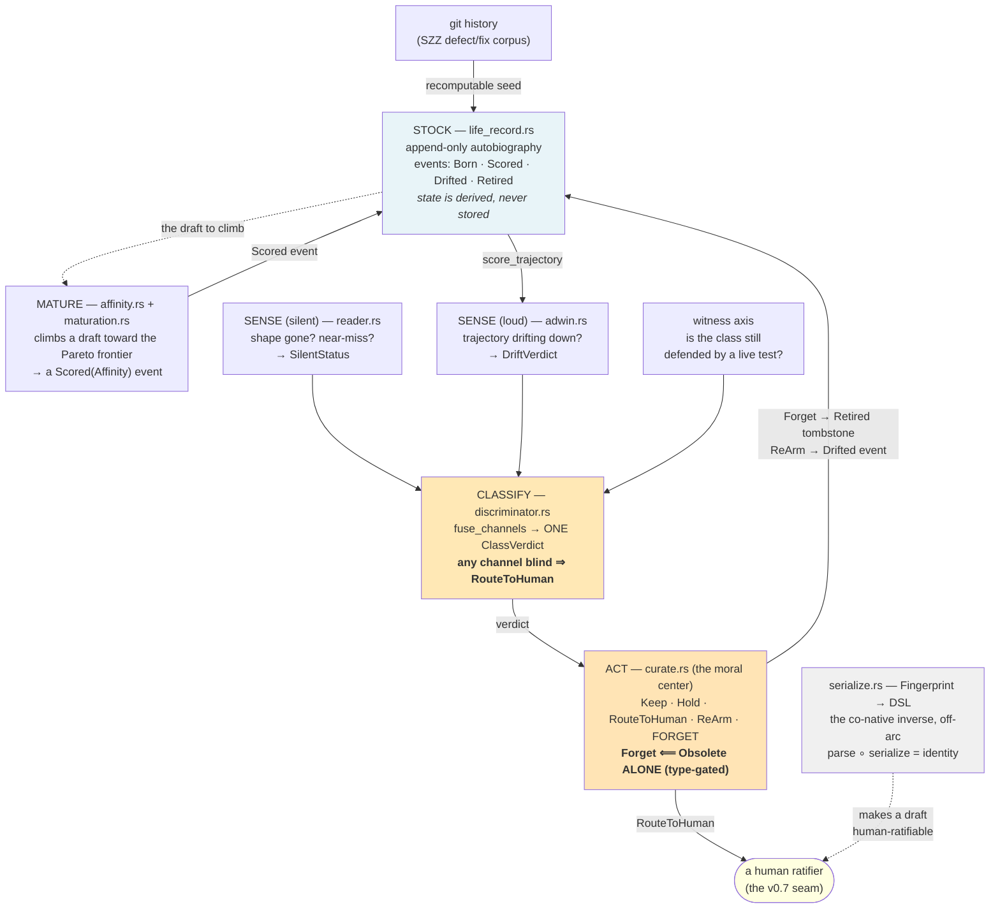
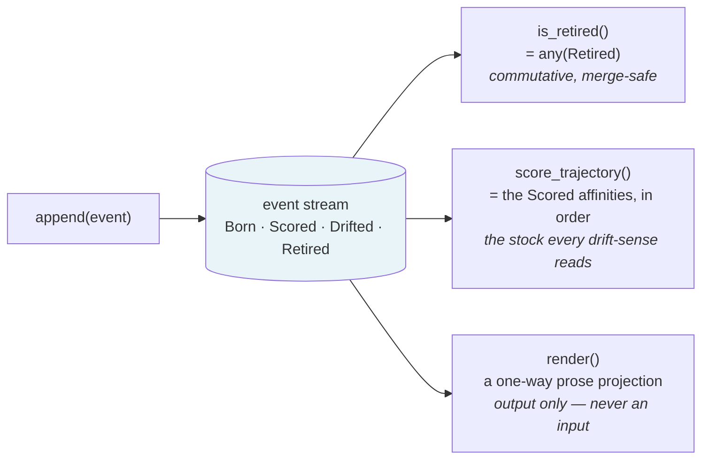
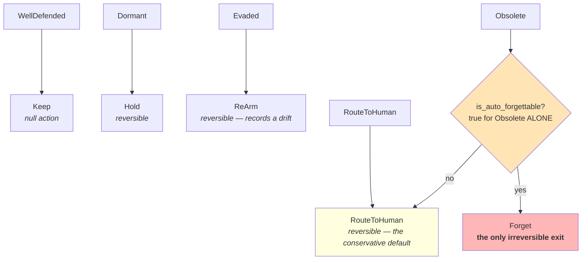
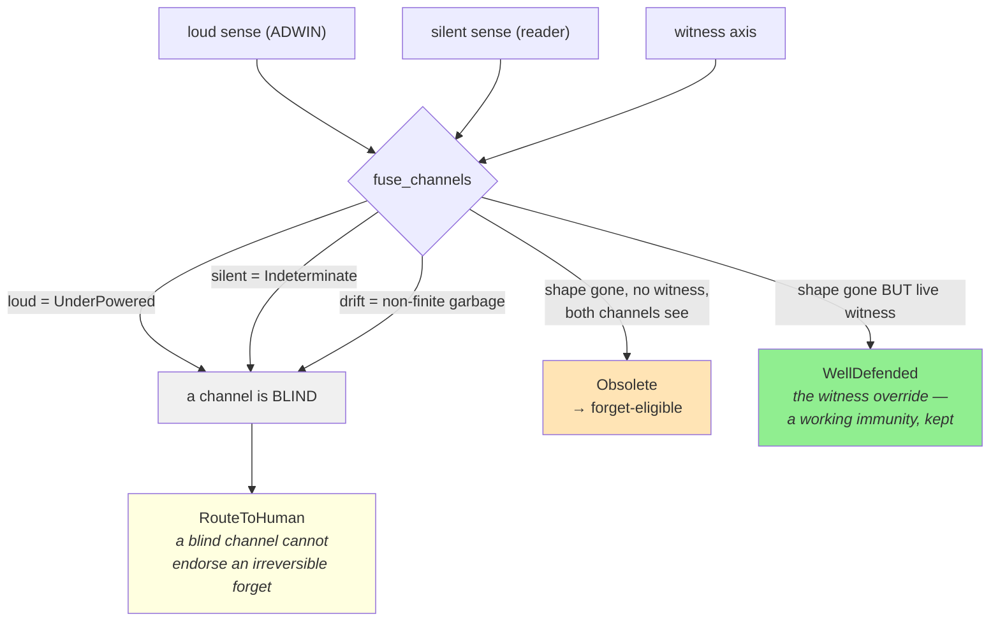
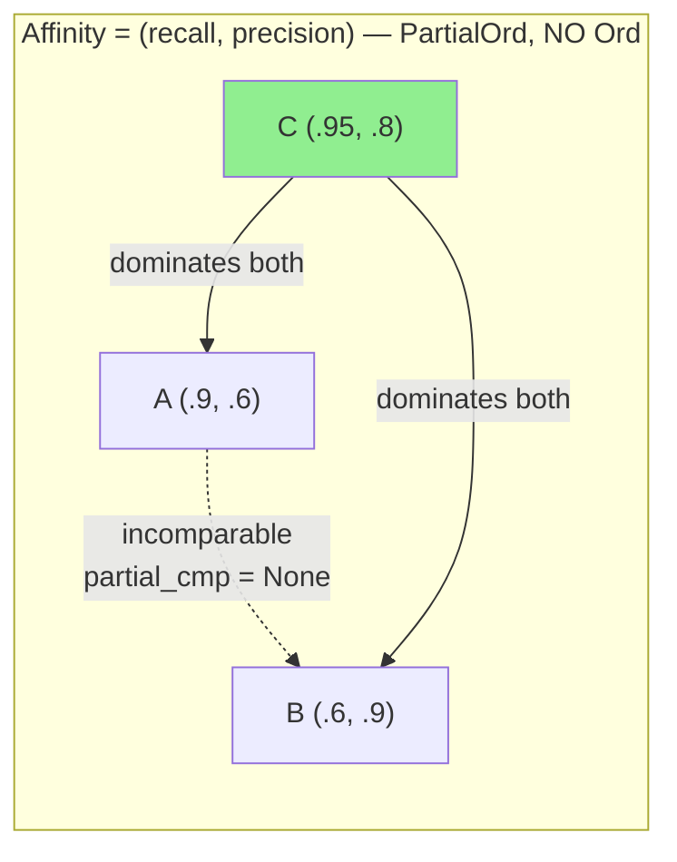
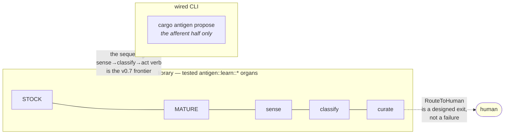

# The v0.6 Anatomy

> Every v0.6 organ, every edge, and the two boundaries that matter — in one picture, then
> the cells worth pausing on. The prose walk is [the maturing
> organism](the-maturing-organism.md); this page is the map you keep open beside it.

v0.6 is a reflex arc: **sense → classify → act**, with a conservative gate on the one
action that can't be undone. Hold that and every box below has a place to sit.

---

## The whole arc



The two highlighted boxes are where the safety lives: the **JOIN** (classify) and the
**gate** (act). Everything else feeds them.

---

## The reservoir every sensor reads

The life-record is not a station on the arc — it's the substrate under it. Its one
load-bearing property is that **current state is a fold over events, never a stored flag**,
which is why it can't drift out of sync the way a cached summary would.



A `Forget` is not an erasure — it's a `Retired` event *pushed onto* the stream. The class's
death is part of its biography, readable forever.

---

## The verdict → action ladder (and the gate)

The discriminator emits one `ClassVerdict`; the curator maps it to one `CurationAction`.
The mapping is total and deterministic, and its ordering — reversible exits before the one
irreversible exit — *is* the morality.



The gate is type-enforced, not convention. An edit that wanted to forget any verdict but
`Obsolete` would have to *delete the gate* to do it — and a test pins that across every
verdict:

```text
$ cargo test -p antigen --test atk_curate_forget_path
test atk_curate2_evading_never_reaches_forget ... ok
test atk_curate2_indeterminate_never_reaches_forget ... ok
test atk_curate5_reversible_actions_never_retire ... ok
... 19 passed; 0 failed
```

---

## The conservatism-JOIN (the keystone cell)

This is the highest-leverage structure in the release: the rule that decides whether a
class can ever *reach* `Obsolete`. Before the fused verdict can be the one auto-forgettable
cell, **every channel must be able to see.**



Read this against one fact — at v0.6's scale the loud sense is `UnderPowered` on *every*
class by default — and the consequence falls out:

> **At v0.6's scale, the system literally cannot auto-forget anything.** Every class hits
> the blind-channel rule and routes to a human. That is the moral center working as
> designed, not an unfinished edge.

---

## The affinity height (why it's a 2-vector, not a number)

The score a class earns is `(recall, precision)` — and it deliberately has *no total
order*. The two axes trade off, so there is no single "better"; there is a frontier.



`A` and `B` are genuinely incomparable — one wins on recall, the other on precision — and
`partial_cmp` returns `None` to say so. `C` Pareto-dominates both. The "maturation ceiling"
is not a magic threshold; it's the frontier the draft can no longer Pareto-improve off of.
A single scalar would silently pick a point on that trade-off and hide the choice; the
2-vector exposes it. (The score is *not* a probability — calibrating it is later work, and
the anti-scalar shape is the honest placeholder.)

---

## The co-native inverse

Off the sense→act arc, on the boundary between machine and human: the serializer turns a
learned fingerprint back into DSL text — the exact inverse of the parser.


`parse ∘ serialize == identity`. The same text a human reads is the text the parser
consumes is the text the macro compiles — round-trip exactness *is* co-nativeness, with no
translation layer between the machine's proposal and the human's ratification. Completeness
is a compiler guarantee: the constraint alphabet is closed, the serializer's match is
exhaustive with no wildcard arm, so a new operator fails to compile until its case is
written.

---

## The two boundaries every reader should mark



1. **Library / CLI.** Every efferent organ is a tested, composable library API. What does
   not ship is a `cargo antigen` verb that drives the whole arc end-to-end — that's the next
   release. The one wired verb is `propose`.
2. **Human-in-the-loop.** `RouteToHuman` is the designed exit where the undecidable leaves
   the machine for a person — not a failure state. At v0.6's scale the JOIN routes most
   forget-eligible classes here, on purpose. The strange loop (antigen curating its own
   classes autonomously) is unfired; that's the v0.7 frontier.

---

## See also

- [the maturing organism](the-maturing-organism.md) — the prose walk of this anatomy
- [drift-detection and the moral center](drift-detection-and-the-moral-center.md) — the
  JOIN and the drift sense from first principles
- [diagrams](diagrams.md) — the scan / audit / witness-tier flow diagrams
- [the immune-system guide, Chapter 11](the-immune-system-a-programmers-guide.md) — the same
  anatomy as biology
